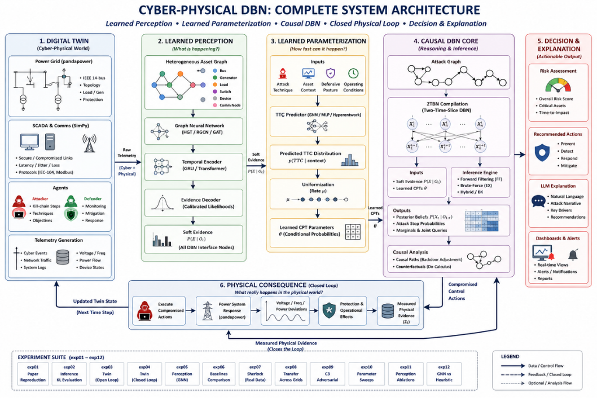

<div align="center">

# Cyber-Physical DBN with Learned Perception and Closed Physical Loop

**Causal intrusion detection for power grids — learned instead of hand-tuned, closed-loop instead of open, honestly evaluated instead of oversold.**

[](https://www.python.org/)
[](https://pytorch.org/)
[](https://www.pandapower.org/)
[](tests/)
[](experiments/)
[](results/figures/)
[](src/)

[Overview](#overview) · [Novelty](#novelty-beyond-the-source-paper) · [Architecture](#architecture) · [Key equations](#key-equations) · [Claims &amp; results](#three-falsifiable-claims) · [Experiment suite](#experiment-suite-exp01exp12) · [Quickstart](#quickstart) · [Module map](#module-map) · [Findings](#notable-findings-including-nulls) · [Citation](#citation)

</div>

---

## Overview

This project extends **Cerotti, D. et al., "Dynamic Bayesian Networks for
the Detection and Analysis of Cyber Attacks to Power Systems,"** *IEEE
Access*, vol. 13, pp. 186289–186306, 2025 — a Dynamic Bayesian Network
(DBN) that models causal dependencies between MITRE-ATT&CK attack steps
and detection analytics in a power system, using uniformization-based CPT
parameterization and Boyen–Koller (BK) approximate inference under three
clustering strategies: exact (EX), heuristic-clustered (CL), and fully
factorized (FF).

The source paper's causal formalism is preserved **exactly** — same 2TBN
structure, same uniformization equation, same three inference strategies —
and reproduced against its own published reference numbers *before* any
extension work began (`experiments/exp01_reproduce_paper.py`, gate result
below). What this project changes is **everything feeding that
formalism**: in the source paper every CPT parameter and every piece of
evidence is hand-assigned by a domain expert, with no physical feedback
loop. Here, a digital twin generates the evidence, a graph neural network
perceives it, a second neural model learns the timing parameters, and a
simulated power grid closes a physical feedback loop the source paper
never attempts.

The project is organized as twelve sequential experiments (`exp01`
through `exp12`), each gated by a structural validation check before its
numbers are trusted, and every hypothesis pre-registered in
[`LAB_NOTEBOOK.md`](LAB_NOTEBOOK.md) *before* the corresponding code was
written — the standard lab-notebook discipline of "hypothesis before,
finding after," applied to a software research project.

## Novelty beyond the source paper

| | Source paper (Cerotti et al.) | This project |
|---|---|---|
| Grid physics | Instability *asserted* by a hand-picked probability | Instability *measured* from a real `pandapower` power-flow solve, fed back as evidence — a closed loop (**C1**) |
| Attack-step timing (TTC) | Hand-elicited from a static Table 3, no stated derivation | Learned by a GNN from digital-twin executions; transfers to **unseen attack graphs with zero expert input** (**C2**) |
| Evaluation baseline | Compares only its own inference variants (EX / CL / FF) | Adds four external baselines (gradient-boosted trees, rule-based, LSTM-AE, GNN classifier) — and reports honestly when they win on raw accuracy |
| Real-world grounding | None — twin/simulation only | Perception layer trained *and* evaluated on real network captures ([Sherlock](https://sherlock.wattson.it/), ACM CODASPY 2025); the resulting twin↔real-data transfer gap is reported as a finding, not hidden |
| Adversarial robustness | Flagged as a future concern, never tested | An RL attacker (PPO, three escalating knowledge levels: blind → analytics-aware → full-DBN-aware) is trained specifically to evade the detector (**C3**) |
| Perception evidence | Fixed `p_pos = p_neg = 10⁻⁴` for every analytic, regardless of true reliability | Learned, temperature-calibrated per-analytic likelihoods entered as virtual/soft evidence |

Every comparison above is backed by a logged, reproducible experiment —
not a claim. [`docs/literature_review.md`](docs/literature_review.md)
traces each design decision to a specific external source (journal
papers, ACM/IEEE conference proceedings, arXiv preprints, GitHub
repositories, and the MITRE ATT&CK for ICS knowledge base), stating what
was reused unchanged, what was extended, and what gap it fills.

## Architecture

<div align="center">

</div>

```
[0] Digital twin        pandapower grid + abstracted comms + attacker/defender agents
                         → labeled telemetry, ground-truth attack state, physical outcome
[1] Perception           Heterogeneous GNN over the cyber-physical asset graph
                         + temporal encoder → calibrated per-analytic likelihoods
                         → SOFT EVIDENCE into the DBN
[2] Parameterization     GNN/hypernetwork: (technique, asset context, defenses) → TTC
                         → p_s via uniformization
[3] DBN causal core      2TBN + FF/BK inference. Consumes soft evidence + learned CPTs.
                         Emits posteriors, causal paths, counterfactuals.
[4] Physical             Compromised control actions execute in the twin → voltage/
    consequence          frequency evolve → instability MEASURED not asserted
                         → physical deviation returns as evidence — THE CLOSED LOOP
[5] Decision (stretch)   DBN posterior as POMDP belief state → RL defense policy
[6] Explanation (opt.)   Max-posterior causal path → LLM analyst narrative
```

**Division of labor, never violated:** neural networks handle perception
(noisy, high-dimensional, statistical). The DBN handles causal fusion
(structured, temporal, explainable). Neither is asked to do the other's
job. This is why the GNN sits on the ~40-node cyber-physical *asset*
graph (buses, lines, IEDs, RTUs, DERs, hosts) rather than the ~20-node
*attack* graph — verified structurally in code:
`test_hops_from_der_bus_to_host_equals_n_gnn_layers` confirms the chosen
GNN depth (3 layers) is exactly the graph-distance from a DER bus to a
compromised host, a claim that is only meaningful because the perception
layer operates on the large, richly-typed asset graph.

## Key equations

Reused exactly from the source paper — never approximated or reinvented:

**Uniformization** (converts a predicted mean time-to-compromise into a
per-slice activation probability), for concurrent attack steps with mean
completion times T̄ᵢ:

```
Δt  = 1 / ( m · Σᵢ (1 / T̄ᵢ) )
p_s = Δt / T̄_s
```

where `m` controls discretization accuracy — swept explicitly in
`experiments/exp10_m_sweep.py`.

**KL divergence** (used throughout to compare inference strategies and,
later, to compare the GNN's learned bus clustering against a heuristic):

```
D_KL(P‖Q) = Σₓ P(x) · log( P(x) / Q(x) )
M_KL      = max over time t ∈ [0,T] of D_KL at t
```

## Three falsifiable claims

- **C1 — Closed loop.** Making grid physics bidirectional — attack drives
  simulated instability, physical deviation returns as evidence — improves
  detection lead time and posterior calibration vs. the open-loop DBN.
- **C2 — Learned parameters.** A GNN mapping (MITRE technique, asset
  context, defensive posture) → attack-step time-to-compromise, trained on
  digital-twin executions, matches or beats expert-elicited TTCs *and*
  transfers to unseen attack graphs.
- **C3 — Adversarial robustness** *(highest novelty)*. Under an RL
  attacker optimizing against the detector, the causal DBN degrades more
  gracefully than deep-IDS baselines, because structural preconditions
  can't be skipped — e.g. a spoofed reporting message can't be injected
  without first establishing MITM, and MITM requires credential access
  first.

## Key results

| Claim | Finding | Evidence |
|---|---|---|
| **Paper reproduction** | Measured FF-vs-EX KL orders of magnitude below the paper's own `2×10⁻²` target; EX/FF latency close to its reference numbers | [`exp01_reproduction_gate.png`](results/figures/exp01_reproduction_gate.png) |
| **C1 — closed loop** | Closed-loop wins at high detection thresholds (θ≥0.7), and the gap widens as θ rises; open-loop has longer raw lead time at low θ — reported both ways, not cherry-picked | [`claims_c1_c2_c3_summary.png`](results/figures/claims_c1_c2_c3_summary.png) |
| **C2 — learned TTC** | `amortized` model, zero expert input, matches or beats expert-elicited TTCs on 25 held-out test graphs (detection rate 1.0 vs. 0.8 at θ=0.5) | [`exp08_ttc_fit_scatter.png`](results/figures/exp08_ttc_fit_scatter.png) |
| **C3 — adversarial robustness** | DBN stays within a narrow ±20-slice lead-time band across attacker-knowledge levels; `lstm_ae`/`rule_based` baselines swing to −100+ slices | [`exp09_robustness_full_sweep.png`](results/figures/exp09_robustness_full_sweep.png) |
| **External baselines** | Several baselines (GBM, rule-based) match or beat the DBN on raw AUC-PR — the DBN's edge is lead time and calibration, not detection accuracy, and that's stated plainly, not buried | [`exp06_pr_curve.png`](results/figures/exp06_pr_curve.png) |
| **Real-data grounding** | Perception layer trained/evaluated on real [Sherlock](https://sherlock.wattson.it/) grid-IDS data; a twin↔Sherlock transfer gap (~0.17 AUC-PR one direction) is reported as a genuine twin-realism finding | [`exp07_pr_curve.png`](results/figures/exp07_pr_curve.png) |
| **GNN clustering vs. heuristic zoning** *(faculty-requested KL-divergence analysis)* | Unsupervised GNN clustering barely agrees with a hand-built heuristic zoning (Adjusted Rand Index = 0.09, a degenerate 31-vs-2 split). A zone-supervised auxiliary loss fixes the partition (ARI → 0.22, balanced) but has **zero** measurable effect on downstream detection KL — the clustering wasn't the actual bottleneck | [`exp12_spatial_zone_map.png`](results/figures/exp12_spatial_zone_map.png) |

Every number above traces to a logged experiment run stamped with a git
SHA and random seed. Full hypothesis → result → interpretation record:
[`LAB_NOTEBOOK.md`](LAB_NOTEBOOK.md) (3,200+ lines). All 45 generated
figures: [`results/figures/`](results/figures/).

## Experiment suite (exp01–exp12)

Each experiment is a standalone, runnable script under `experiments/`
that writes seeded, git-SHA-stamped CSVs to `results/` and ends with a
lettered structural validation gate (never a "does it look good" check —
see [Research integrity principles](#research-integrity-principles)).

| # | Script | Tests |
|---|---|---|
| 01 | `exp01_reproduce_paper.py` | Reproduces the source paper's Scenarios 1 & 2 (KL, latency, memory) against its published reference table — the gate every later claim depends on |
| 02 | `exp02_latched_kl.py` | Resolves an internal inconsistency found in the source paper's own published figures (memoryless vs. latched reaction assumptions) |
| 03 | `exp03_twin_open_loop.py` | Feeds the digital twin's own (not hand-scripted) analytic firing times into the DBN, open-loop |
| 04 | `exp04_closed_loop_c1.py` | Tests **C1**: closed- vs. open-loop lead time and calibration |
| 05 | `exp05_perception.py` | Replaces the fixed `p_pos=p_neg=10⁻⁴` evidence with a calibrated, learned likelihood from twin telemetry |
| 06 | `exp06_baselines.py` | Four external ML baselines vs. the proposed system — AUC-PR, calibration, lead time, PR curves |
| 07 | `exp07_sherlock.py` | Grounds the perception layer on real data ([Sherlock](https://sherlock.wattson.it/)); bidirectional twin↔real-data transfer |
| 08 | `exp08_transfer_c2.py` | Tests **C2**: learned TTC transfer to 25 held-out, never-seen attack graphs |
| 09 | `exp09_adversarial_c3.py` | Tests **C3**: PPO-trained RL attacker vs. every detector, three knowledge levels |
| 10 | `exp10_m_sweep.py` | Sweeps the discretization parameter `m` from the uniformization equation |
| 11 | `exp11_perception_ablation.py` | Isolates whether the GNN's graph structure — not just its parameter count — drives detection quality, vs. a per-asset MLP with zero message passing |
| 12 | `exp12_gnn_cluster_vs_heuristic.py` | Faculty-requested: KL-divergence / ARI comparison between GNN-derived bus clustering and the heuristic zone map, plus a zone-supervised auxiliary-loss ablation |

## Quickstart

```bash
python -m venv .venv && source .venv/bin/activate
pip install -e .
python scripts/verify_stack.py          # smoke-tests every dependency
pytest tests/ -q                        # 530 tests
```

Run any experiment — each writes seeded, git-SHA-stamped CSVs to `results/`:

```bash
python experiments/exp01_reproduce_paper.py     # paper reproduction gate
python experiments/exp04_closed_loop_c1.py      # closed-loop lead time (C1)
python experiments/exp09_adversarial_c3.py      # adversarial robustness (C3)
```

Most experiments accept `--smoke` for a fast, tiny-scale correctness run
(structural gate only, explicitly not treated as a real result) before
committing to the full multi-minute run:

```bash
python experiments/exp12_gnn_cluster_vs_heuristic.py --smoke
```

Rebuild every figure directly from already-logged results — no
recomputation of any metric:

```bash
python scripts/build_summary_tables.py       # cross-experiment CSV consolidation
python scripts/generate_journal_plots.py     # per-experiment figures
python scripts/generate_publication_plots.py # threshold sweeps, spatial maps, claims summary
```

Interactive demo dashboard (Streamlit — see `.claude/launch.json`):

```bash
pip install -e ".[demo]"
streamlit run webapp/app.py
```

## Module map

```
src/
├── attack_graph/        graph.py            NetworkX attack graph, MITRE technique mapping
│                         family.py            attack-graph-family generator for C2's transfer test
├── dbn/                  compiler.py          attack graph → 2TBN compiler
│                         parameterization.py  uniformization, CPT construction
│                         inference.py          FF / EX / BK forward-filtering inference engine
│                         soft_evidence.py      virtual/likelihood evidence entry
│                         forward_sample.py     forward sampling utilities
├── twin/                  grid.py              pandapower grid model, power-flow interface
│                         comms.py              SimPy control-center ↔ substation messaging
│                         attacker.py           scripted attacker agent, TTC-driven timing
│                         rl_attacker.py         Gym-compatible PPO adversarial-attacker env
│                         consequence.py         physical-deviation → evidence, ZoneMap heuristic
│                         runner.py              orchestrates twin end-to-end, discretization
├── perception/            asset_graph.py       heterogeneous cyber-physical asset graph builder
│                         encoder.py            HGT/RGCN heterogeneous GNN + temporal encoder
│                         features.py            dynamic feature construction from telemetry
│                         calibration.py         temperature scaling, ECE
│                         sherlock_loader.py      real Sherlock dataset → project's feature schema
├── parameterization/      amortized.py         learned (technique, context) → TTC model (C2)
├── baselines/             lstm_ae.py, gbm.py, gnn_classifier.py, rule_based.py, common.py
└── eval/                  metrics.py            KL divergence, M_KL
                          lead_time.py          detection lead-time definition and sweep
                          calibration.py         ECE, Brier score, reliability diagrams
                          provenance.py          git SHA capture for every logged run
```

## Research integrity principles

Every result in this repository is governed by five non-negotiable rules
(the full contract is [`CLAUDE.md`](CLAUDE.md)):

1. **Never fabricate, estimate, or hardcode a numerical result.** If an
   experiment hasn't run, the value doesn't exist — code raises or writes
   `NotImplemented`, never a plausible-looking placeholder.
2. **Never write a table, plot, or summary from expected values.** Every
   reported number traces to a logged run with a seed; a results table
   never appears before the experiment that produced it has run.
3. **A failed validation gate is reported, not adjusted to pass.** No
   target is silently loosened, and a baseline beating the proposed
   system is reported prominently, not buried in a CSV column.
4. **Every experiment logs its git SHA, seed, config, and timestamp** to a
   CSV under `results/`. No exceptions.
5. **Uncertainty is stated explicitly**, including which parts of an
   implementation the author was least sure matched the source paper, and
   what was checked (not just asserted) before accepting a surprising
   result.

In practice: each experiment's own module docstring states its
hypothesis and any open uncertainty before the code below it runs; each
ends with a lettered gate (`(a)`, `(b)`, `(c)`...) testing *structural*
correctness only — shapes, determinism, finiteness, provenance — never
"does the number look right." The KL/ARI/AUC-PR numbers themselves always
print unconditionally, whether or not they favor the proposed system.

## Notable findings, including nulls

Negative and mixed results are kept and reported exactly like positive
ones — a sample, in full detail in [`LAB_NOTEBOOK.md`](LAB_NOTEBOOK.md):

- **C1 is not a clean win.** Closed-loop beats open-loop only above a
  detection-threshold crossover point; below it, open-loop has longer raw
  lead time. Both regimes are reported.
- **exp06's baselines beat the proposed system on raw AUC-PR.** The
  project's actual argument — lead time, calibration, explainability,
  robustness under adversarial adaptation — is stated as such, not
  disguised as a raw-accuracy win.
- **Sherlock (real-data) transfer is asymmetric.** Sherlock→twin transfer
  is strong (~0.99 AUC-PR); twin→Sherlock is weak (~0.17) — reported as a
  finding about twin realism, not smoothed over.
- **The GNN-vs-heuristic clustering gap is real and diagnosed, not just
  measured.** Root cause: unsupervised `KMeans(k=2)` on embeddings never
  trained for a clustering objective produces a degenerate 31-vs-2 split.
  A follow-up zone-supervised auxiliary loss *does* fix the partition
  (ARI 0.09 → 0.22) but this improvement has **zero** measurable effect on
  downstream detection KL — evidence that the clustering degeneracy was
  never the actual bottleneck for detection fidelity, a more specific and
  more useful finding than either "it's broken" or "it's fixed."
- **A real float32-overflow bug** was found and fixed during a full
  codebase debugging pass (`src/baselines/lstm_ae.py`,
  `src/perception/calibration.py`) — verified to have zero effect on
  previously published numbers by rerunning the affected experiments in
  full and diffing outputs bit-for-bit before and after the fix.

## Data

Twin-generated data is synthetic and gitignored — nothing to download for
the core pipeline. Real-world grounding uses
[**Sherlock**](https://sherlock.wattson.it/) (Wagner et al., ACM CODASPY
2025), a real power-grid intrusion-detection dataset built on the Wattson
co-simulator (steady-state power flow via `pandapower`, IEC 60870-5-104
control-center↔substation communication); see
[`docs/sherlock_download.md`](docs/sherlock_download.md) for download
steps and every discrepancy found between the dataset's documented and
actual structure. The dataset itself is never committed.

## Tech stack

| Library | Role |
|---|---|
| [`pandapower`](https://www.pandapower.org/) | Steady-state power-flow solver for the digital twin |
| [`pgmpy`](https://pgmpy.org/) | DBN structure and CPD representation |
| [`torch`](https://pytorch.org/) + [`torch-geometric`](https://pytorch-geometric.readthedocs.io/) | Heterogeneous GNN (HGT / RGCN), temporal encoder |
| [`simpy`](https://simpy.readthedocs.io/) | Discrete-event attacker/comms simulation |
| [`networkx`](https://networkx.org/) | Attack-graph representation before DBN compilation |
| [`scikit-learn`](https://scikit-learn.org/) | Calibration, PR curves, KMeans, Adjusted Rand Index |
| [`stable-baselines3`](https://github.com/DLR-RM/stable-baselines3) | PPO for the adversarial RL attacker (C3) |
| [`pytest`](https://pytest.org/) | 530 tests, one per numerical component |

## Project structure

```
src/                    see Module map above
experiments/             exp01-exp12, one runnable script per experiment
results/                CSV outputs (git-SHA + seed logged), figures/, summary/
configs/                 YAML experiment configs — no magic numbers in source
tests/                   530 tests, one per numerical component
scripts/                 cross-experiment consolidation and figure-generation scripts
webapp/                  Streamlit demo dashboard
docs/                    Sherlock dataset download notes, literature review
LAB_NOTEBOOK.md         Hypothesis before, finding after — every experiment
CLAUDE.md                The project's living research-integrity contract
```

## Background reading

[`docs/literature_review.md`](docs/literature_review.md) ties every
architectural decision in this codebase back to a specific external
source — journal papers, ACM/IEEE conference proceedings, arXiv preprints,
GitHub repositories, and the MITRE ATT&CK for ICS knowledge base — stating
what was reused unchanged, what was extended, and what gap it fills.

## Citation

If referencing the source formalism this project extends:

```bibtex
@article{cerotti2025dbn,
  title   = {Dynamic {B}ayesian {N}etworks for the {D}etection and {A}nalysis
             of {C}yber {A}ttacks to {P}ower {S}ystems},
  author  = {Cerotti, Davide and Raiteri, Daniele Codetta and
             Franceschinis, Giuliana and others},
  journal = {IEEE Access},
  volume  = {13},
  pages   = {186289--186306},
  year    = {2025}
}
```

If referencing the real dataset used for grounding (Section
[Data](#data)):

```bibtex
@inproceedings{wagner2025sherlock,
  title     = {Sherlock: A Dataset for Process-aware Intrusion Detection
               Research on Power Grid Networks},
  author    = {Wagner, Marija and Bader, Lennart and Wolsing, Konrad and
               Serror, Martin and others},
  booktitle = {Proceedings of the 15th ACM Conference on Data and
               Application Security and Privacy (CODASPY)},
  year      = {2025}
}
```

---

<div align="center">

**Author:** Sai Krishna Bodapati

</div>
